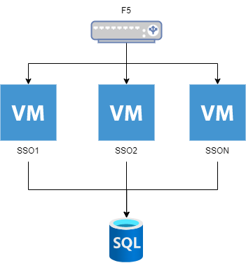

rh-sso-host
=========

Desplegar Red Hat Single Sign On en modo standalone o standalone-ha utilizando como base de datos un sqlserver y un F5 como proxy.
El rol esta preparado para el auto descubrimiento de nodos con jgroups utilizando el protocolo udp e infinispan para la replicacion de session.

Referancia
----------
[Server Installation and Configuration Guide](https://access.redhat.com/documentation/en-us/red_hat_single_sign-on/7.5/html/server_installation_and_configuration_guide/index)

Arquitectura
------------


Requermientos
------------
Los nodos que seran utilizados deben contar con los siguientes recursos:
* SO: RHEL 8
* vCPU: 4 cores
* RAM: 8GB
*  Disco: 100 GB

En caso de ser una instalacion desconectada se debe copiar los instaladores en algun repositorio accesible para su descarga.
Se debe poder instalar java en la version 1.8

Consideraciones
------------
El proxy se debe configurar teniendo en cuenta estos header
* Host
* X-Real-IP         
* X-Forwarded-For    
* X-Forwarded-Host   
* X-Forwarded-Server 
* X-Forwarded-Port   
* X-Forwarded-Proto 

Ademas de configurar el sticky session para un mejor rendimiento del sso 

  
Replicación de session

Por defecto en el modo standalone-ha el sso replica en dos nodos la sesion en caso de que se desee replicar a mas de un nodo es necesario ejecutar el siguente comando en todos los nodos.
Reemplazar el valor 2 por el numero de nodos que requiera

```shell
[root ~]# jboss-cli.sh --commands="embed-server --server-config=standalone-ha.xml, /subsystem=infinispan/cache-container=keycloak/distributed-cache=sessions:write-attribute(name=owners,value=2)"
[root ~]# systemctl restart rh-sso
```
Variables del rol
----------

1. rh_sso_system_user: Usuario de sistema operativo con el que se instalara la solucion
2. rh_sso_user: Usuario administrador con el que se adminsitrara el SSO
3. rh_sso_password: Contraseña del usuario para el SSO
4. rh_sso_url: URL para descargar el instalador del sso en formato zip
5. database_providers: Proveedor de base de datos (mssql)
6. database_driver_url: URL para descargar el driver en formato jar
7. database_jdbc_url: Conexion jdbc que se utilizara
8. database_jdbc_user: usuario para la conexión a la base de datos
9. database_jdbc_password: contraseña de la base de datos
10. database_jdbc_max_pool: Cantidad maxima de conexiones que puede utilizar la base de datos
11. apply_patch: Se pone el valor en true si se cuenta con parches par aplicar
12. patches: URL de cada parche que se quiere aplicar
13. profile: Los varlores pueden ser standalone o standalone-ha